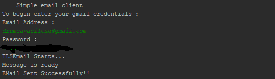

# Course: *Network Programming*
------
# Topic: *SMTP Client App*
### Author: *Drumea Vasile*
------
## Objectives :
1. Study the SMTP and POP3 protocols and their usages in Web communication;

2. Find out about the Java components responsible for implementing interactions with the required protocols;

3. Create a client app which supports sending and reading emails using an account;

## Additional tasks :
1. Sending an email with attachments;

2. Sending an email in HTML format with images;

3. Creating a class, POP3Header which facilitates reading headers from message(stored in a dictionary);

## Theory :

### Email Protocols Overview

Email Protocols: IMAP, POP3, SMTP;

Basicaly, a protocol is a standard method used at each end of a communication channel, in order to properly transmit information. In order to deal with your email you must use a client to access a mail server. The mail client and mail server can exchange information with each other using a variety of protocols.

**Post Office Protocol version 3 (POP3)** is a standard mail protocol used to receive emails from a remote server to a local email client. POP3 allows you to download email messages on your local computer and read them even when you are offline. Note, that when you use POP3 to connect to your email account, messages are downloaded locally and removed from the email server.

By default, the POP3 protocol works on two ports:

  * Port 110 - this is the default POP3 non-encrypted port;
  
  * Port 995 - this is the port you need to use if you want to connect using POP3 securely;

**Internet Message Access Protocol (IMAP)** is a mail protocol used for accessing email on a remote web server from a local client. 

While the POP3 protocol assumes that your email is being accessed only from one application, IMAP allows simultaneous access by multiple clients. This is why IMAP is more suitable for you if you're going to access your email from different locations or if your messages are managed by multiple users.

By default, the IMAP protocol works on two ports:

  * Port 143 - this is the default IMAP non-encrypted port;
  
  * Port 993 - this is the port you need to use if you want to connect using IMAP securely;

**Simple Mail Transfer Protocol (SMTP)** is the standard protocol for sending emails across the Internet.

By default, the SMTP protocol works on three ports:

  * Port 25 - this is the default SMTP non-encrypted port;
  
  * Port 2525 - this port is opened on all SiteGround servers in case port 25 is filtered (by your ISP for example) and you want to send non-encrypted emails with SMTP;
  
  * Port 465 - this is the port used if you want to send messages using SMTP securely;

## Implementation :

To implement the app I've used

## Screenshot

